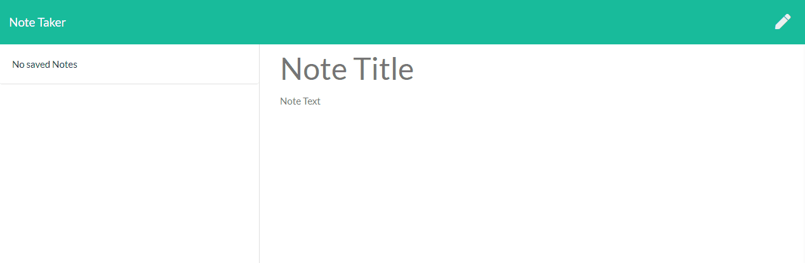

# note-taker   
## Description  
This is a basic note taker or task list app.  Add a new note by editing the note title and note text.  Click the save button to save the note to your note list.  Click on any note in the list to display the note.  Click the delete button next to any note in the list to delete the note.
 

## Table of Contents
  * [Description](#Description)
  * [Demo](#Demo)
  * [Installation](#Installation)
  * [Usage](#Usage)
  * [License](#License)
  * [Contributing](#Contributing)
  * [Test](#Tests)
  * [Questions](#Questions)
 

## Demo

## Installation
Clone the repo to your local machine.  Run npm install in the root directory to install the dependencies.  Run npm run start to start the app.
 

## Usage
The app can be used as a note taker or task list.
 

## License
This application is covered under the [MIT](https://www.opensource.org/licenses) license.
 

## Contributing
Please submit all issues through github issues tracker in the repo.
 

## Tests
No tests are currently available for this app.
 

## Questions
If you have any questions, feel free to find me on github, [jburz](https://www.github.com/jburz) or send me an email at jake.bilbao.04.06@gmail.com.
  